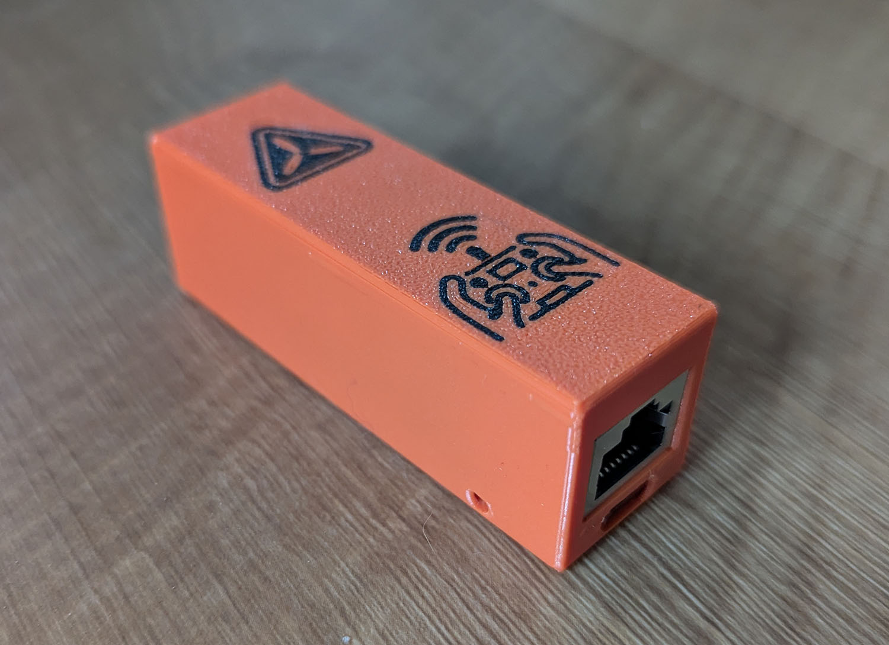

# 3D-Printable Case for RH+ELRS Netpack

* Tab closure
* Pin access to onboard buttons
* Fits with or without PoE module and with or without installed SD card
* Prints without supports
* Optional single-layer multicolor print with RotorHazard and ELRS logos
* Tested with PETG, 0.4mm toolhead, Bambu A1

## Available files

* 3MF: Includes multicolor definitions and imported logos for lid
* STL: model only
* FCStd: FreeCAD parametic design source
